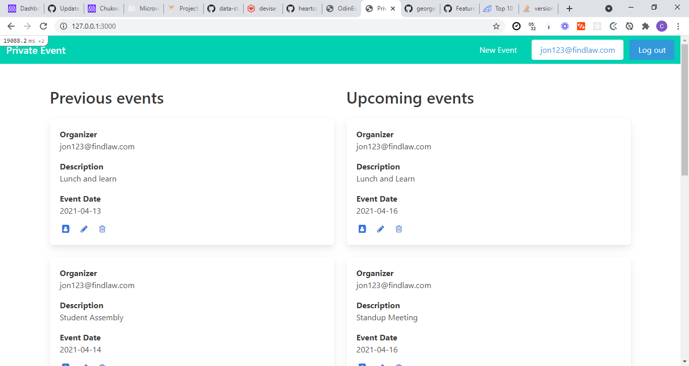

## Private Event

Event planner application which allows users to create events and then manage user signups. Users can create events and assist an event

## Built With

- Ruby 
- Ruby on Rails
- Devise gem

## Getting Started

To get a local copy of the repository please run the following commands on your terminal:

$ cd folder-name

> git clone https://github.com/EroAuditore/private-event.git

- $ cd private-event
- $ bundle install
- $ rails db:migrate
- $ yarn install --check-files

## Authors

👤 Eduardo Rodriguez

Github: @EroAuditore
Linkedin: EroAuditore

👤 Chukwuma Obasi

GitHub: @ccobasi
LinkedIn: chukwuma-obasi

## 🤝 Contributing

Contributions, issues, and feature requests are welcome!

# Contributing

Contributions, issues and feature requests are welcome! Start by:

- Forking the project
- Cloning the project to your local machine
- cd into the project directory
- Run git checkout -b your-branch-name
- Make your contributions
- Push your branch up to your forked repository
- Open a Pull Request with a detailed description to the development branch of the original project for a review

## Show your support

Give a ⭐️ if you like this project
